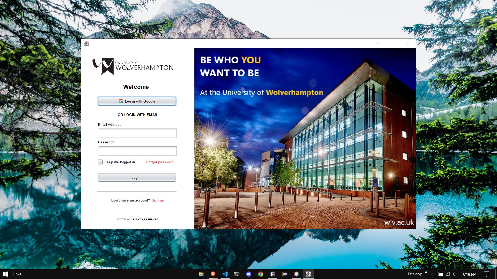
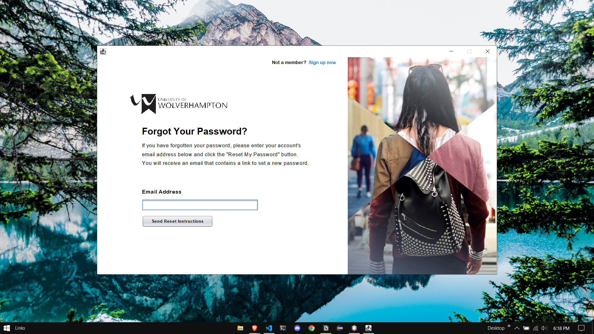
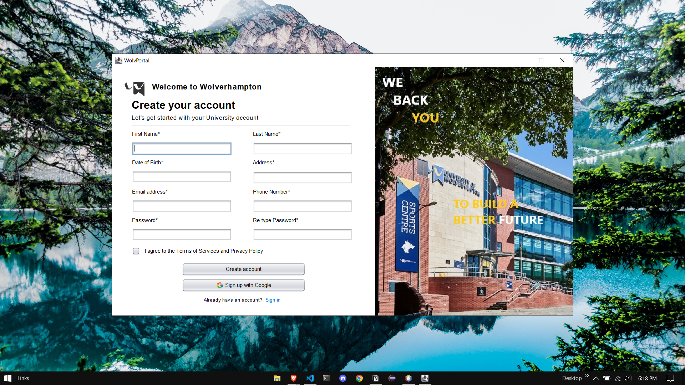

# Course Management System

A college assignment project designed to simplify the management of courses and their information. With this system, you can easily add, edit, delete, view, and search for courses in a user-friendly manner. The application is built using Java and Java Swing, and uses MySQL for data storage.

This system is designed to meet the needs of administrators, teachers, and students who need to manage and access information about courses offered by the college. The user-friendly interface makes it easy to navigate the system, and the various features allow you to manage courses with ease. Whether you need to add a new course, edit an existing course, or view all the courses offered, this system has you covered.

## Screenshots

## Contribution

If you find any bugs or have any suggestions, feel free to open an issue or a pull request.
